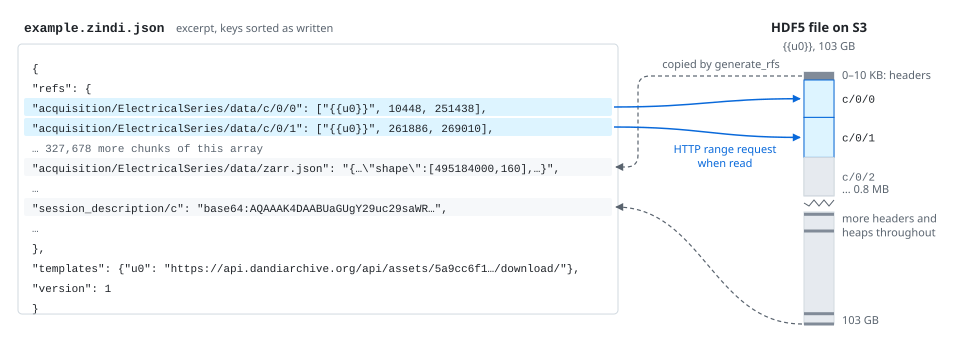
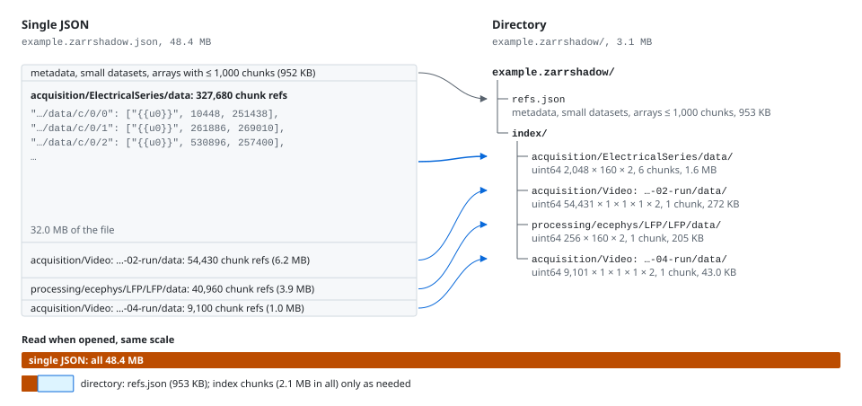

# Zindi

Represent remote HDF5 NWB files as Zarr v3 via JSON reference file systems.

## What it does

Zindi reads the metadata and chunk layout of an HDF5 file (local or remote) and produces a small JSON file that describes the same data as a Zarr v3 store. The JSON contains:

- **Zarr v3 metadata** (`zarr.json` entries for every group and array)
- **Chunk references** pointing to byte ranges in the original HDF5 file (`[url, offset, size]`)
- **Inline data** for small datasets (base64-encoded)

When you open this JSON, Zindi provides a zarr v3 `Store` that fetches chunks on demand from the remote HDF5 file using HTTP Range requests. No data is copied — the original file is the source of truth.



The metadata and small datasets are copied into the JSON when it is generated. Each chunk is a `[url, offset, size]` pointer into the original file and is fetched with an HTTP range request when it is read. The strip on the right enlarges the first 0.8 MB of the 103 GB file, where `c/0/0` begins right after 10 KB of HDF5 headers. The rest of the file holds more chunks, with more headers and heaps spread through it.

## How it relates to Lindi

[Lindi](https://github.com/NeurodataWithoutBorders/lindi) does something similar but targets Zarr v2 and creates an h5py-like shim object for use with `pynwb.NWBHDF5IO`.

Zindi instead produces a proper Zarr v3 store, following the [unified convention](https://github.com/NeurodataWithoutBorders/lindi/issues/125) that aligns Lindi and hdmf-zarr. hdmf-zarr adopted this convention in its Zarr v3 release (0.14.0), so a Zindi store can be read with `hdmf_zarr.NWBZarrIO` directly, without an h5py shim layer.

## Installation

```bash
pip install -e .
```

## Quick start

### Generate a reference file system from a remote NWB file

```python
from zindi import generate_rfs, write_rfs

url = "https://api.dandiarchive.org/api/assets/6e7e9b91-0d66-45af-b646-dfb11e4d9967/download/"

rfs = generate_rfs(url)
write_rfs(rfs, "example.zindi.json")
```

Just pass the URL — Zindi handles remote file access internally.

### Load the JSON and read data as Zarr v3

```python
from zindi import open_rfs

root = open_rfs("example.zindi.json")

# Browse the hierarchy
print(root.attrs["neurodata_type"])  # 'NWBFile'

# Read data (fetched from remote HDF5 via byte-range requests)
spike_times = root["units/spike_times"][:]
print(spike_times.shape)  # (359781,)
```

### Generate from a local HDF5 file

If you have a local copy but want chunk references to point to a remote URL:

```python
from zindi import generate_rfs, write_rfs

rfs = generate_rfs(
    "https://example.com/data.nwb",
    local_hdf5_path="/path/to/local/data.nwb",
)
write_rfs(rfs, "data.zindi.json")
```

### Read as an NWB file with hdmf-zarr

With hdmf-zarr 0.14.0 or later, pass the store to `NWBZarrIO`:

```python
from hdmf_zarr import NWBZarrIO
from zindi import RfsStore, load_rfs

with NWBZarrIO(RfsStore(load_rfs("example.zindi.json")), mode="r") as io:
    nwbfile = io.read()
    print(nwbfile.acquisition)
```

## Files with many chunks

A long electrophysiology recording can have millions of chunks. Listing each one in the JSON makes a file of hundreds of megabytes that has to be downloaded and parsed before anything can be read. For this reason, `generate_rfs` gives any array with more than `chunk_index_threshold` chunks (default 1000) a chunk index in place of individual refs. The index is a `uint64` array shaped like the chunk grid plus a last axis of length 2, holding `(offset, nbytes)` for each chunk, the same layout as the Zarr v3 sharding index. Chunks that were never written hold `2**64 - 1`.

Write to a path that does not end in `.json` to get a directory:

```python
rfs = generate_rfs(url)
write_rfs(rfs, "example.zindi")
root = open_rfs("example.zindi")  # also accepts a URL to the directory
```



This is the DANDI file from the example below in both forms. The 327,680 chunk refs of the `ElectricalSeries` are two thirds of the single JSON, and the whole 48.4 MB is read when it is opened. In the directory, the four arrays with more than 1,000 chunks become index arrays, and opening reads only `refs.json`.

Opening the directory reads only `refs.json`. Each index is itself an ordinary Zarr array, chunked so that one index chunk holds the entries for about 65,536 data chunks and compressed with Blosc (zstd with byte shuffle). An index chunk is read the first time any data chunk it covers is requested, and recent index chunks are kept in memory. Because they are plain Zarr arrays, any Zarr library, including zarrita.js, can read them. For a synthetic NWB file with 2 million chunks, the directory is 0.8 MB against 176 MB for the single JSON, and `NWBZarrIO.read()` takes 0.04 s against 1.5 s.

### Example

This file from DANDI has an `ElectricalSeries` of 495,184,000 samples by 160 channels (int16 at 20 kHz, about 6.9 hours). The HDF5 file stores it in chunks of 241,790 samples by 1 channel, about 12 seconds of one channel each, so its chunk grid is 2,048 by 160, or 327,680 data chunks.

```python
rfs = generate_rfs("https://api.dandiarchive.org/api/assets/5a9cc6f1-aeaf-46cc-aae7-ea27960236ea/download/")
write_rfs(rfs, "example.zindi")
```

In the single JSON, those 327,680 data chunks are 327,680 entries in `refs`. In the directory, they are one index array at `index/acquisition/ElectricalSeries/data` with shape (2,048, 160, 2), chunked as (409, 160, 2), so it has 6 index chunks of about 320 KB each after compression. Each index chunk covers 409 rows of the data chunk grid for all 160 channels, which is the first 82 minutes of the recording for index chunk 0, the next 82 minutes for index chunk 1, and so on.

To read one second starting one hour in on channel 17:

```python
root = open_rfs("example.zindi")
data = root["acquisition/ElectricalSeries/data"][72_000_000:72_020_000, 17]
```

![Reading data chunk c/297/17: row 297 falls in index chunk 0, entry [297, 17] gives the byte range, and one range request fetches it](docs/images/index-lookup.svg)

The circled numbers match the steps below. The drawing is not to scale: each of the 2,048 rows of the chunk grid would be a fraction of a pixel, and the last index chunk, which covers only 3 rows, is drawn larger than it is.

1. Samples 72,000,000 to 72,019,999 fall in row 297 of the data chunk grid (297 × 241,790 = 71,811,630), so zarr asks the store for data chunk `acquisition/ElectricalSeries/data/c/297/17`.
2. The store finds that `(297, 17)` is in index chunk `(0, 0, 0)`, since 297 // 409 = 0, and reads `index/acquisition/ElectricalSeries/data/c/0/0/0`. This is the only index read, and later reads in the first 82 minutes reuse it from memory.
3. Entry `[297, 17]` of that index chunk gives the byte offset and size of the data chunk in the HDF5 file, and the store fetches those bytes with one HTTP range request.

Reading the same second on all 160 channels needs data chunks `c/297/0` through `c/297/159`, which all sit in the same index chunk, so it still reads one index chunk and then fetches 160 data chunks.

Writing to a path ending in `.json` still produces a single file, with every chunk listed in `refs`. Pass `chunk_index_threshold=None` to `generate_rfs` to list every chunk in memory as well.

## DANDI support

Zindi handles DANDI API URLs automatically. The DANDI URL (which returns a 302 redirect to a presigned S3 URL) is resolved transparently, with the presigned URL cached for 10 minutes.

For embargoed datasets, set the appropriate environment variable:

```bash
export DANDI_API_KEY=your_token_here
# or for sandbox:
export DANDI_SANDBOX_API_KEY=your_token_here
```

## Unified convention

The generated JSON follows the [unified Zarr v3 convention](https://github.com/hdmf-dev/hdmf-zarr/issues/335) for representing HDF5/NWB concepts in Zarr:

| Feature | Convention |
|---------|-----------|
| Groups | `zarr.json` with `node_type: "group"` |
| Arrays | `zarr.json` with `node_type: "array"`, codecs pipeline |
| Scalars | Zero-dimensional array: `shape: []`, `chunk_shape: []`, single chunk keyed `c` |
| Dataset dtype | `_DTYPE` attribute on non-compound arrays: the numpy type name (e.g. `"float64"`), `"str"` for strings, `"object_reference"` for references |
| Soft links | `_LINKS` list on parent group: `[{"name", "source", "path"}]` |
| References in datasets | `_DTYPE: "object_reference"` with target paths as strings; compound reference fields listed in `_REFERENCE_FIELDS` |
| Spec location | Root `.specloc` attribute holds the plain path `"specifications"` |
| References in attrs | `{"_REFERENCE": {"source": ".", "path": "/target"}}` |
| NaN/Inf in attrs | Written as the float tokens `NaN`, `Infinity`, `-Infinity`, as zarr-python does |
| Strings | `data_type: "string"` with `vlen-utf8` codec |

## Local chunk caching

By default, every array slice triggers an HTTP Range request. For repeated access to the same data (common in interactive analysis), you can enable a persistent local cache backed by SQLite:

```python
from zindi import LocalCache, open_rfs

cache = LocalCache()  # persists to ~/.zindi/cache
root = open_rfs("example.zindi.json", local_cache=cache)

# First read fetches from remote; subsequent reads are served from disk
data = root["units/spike_times"][:]
```

To prevent unbounded cache growth, set a size limit. Least-recently-accessed chunks are evicted when the limit is exceeded:

```python
cache = LocalCache(max_size_bytes=500_000_000)  # 500 MB cap
```

## Request merging

When reading a multi-chunk slice, zindi automatically merges nearby HTTP Range requests into fewer, larger fetches. For example, reading 10 contiguous chunks from a remote file may result in a single HTTP request instead of 10.

Two parameters control the merging behavior:

- `merge_gap`: maximum gap in bytes between two ranges to merge (default 256 KB)
- `max_merge_size`: maximum size of a single merged request (default 50 MB)

```python
root = open_rfs("example.zindi.json", merge_gap=1_000_000, max_merge_size=100_000_000)
```

Set `merge_gap=0` to disable merging and fetch every chunk individually.

## Architecture

```
zindi/
├── generate_rfs.py          # HDF5 → Zarr v3 reference file system
├── open_rfs.py              # Open RFS as zarr.Group
├── rfs_store.py             # Zarr v3 Store backed by reference file system
├── chunk_index.py           # Byte-range indexes for arrays with many chunks
├── http_store.py            # Read-only zarr Store over HTTP, for remote index arrays
├── remfile.py               # File-like HTTP reader optimized for h5py
├── h5_filters_to_codecs.py  # HDF5 filters → Zarr v3 codec pipeline
├── h5_chunk_utils.py        # HDF5 chunk byte range utilities
├── attr_conversion.py       # HDF5 attrs → JSON-serializable values
└── url_resolver.py          # DANDI URL resolution with caching
```

**Data flow:**

```
Remote HDF5 file
    ↓ (h5py + Remfile: read metadata and chunk layout)
Reference file system (.zindi.json, or .zindi/ directory with chunk indexes)
    ↓ (RfsStore: zarr v3 Store implementation)
zarr.Group (read-only, chunks fetched on demand)
    ↓ (hdmf_zarr.NWBZarrIO)
pynwb NWBFile
```

## Current limitations

This is v0.1 — the following are not yet implemented:

- Nested compound dtypes (structs within structs)
- Cross-file object references (same-file references are supported)
- External array links (`_EXTERNAL_ARRAY_LINK`)
